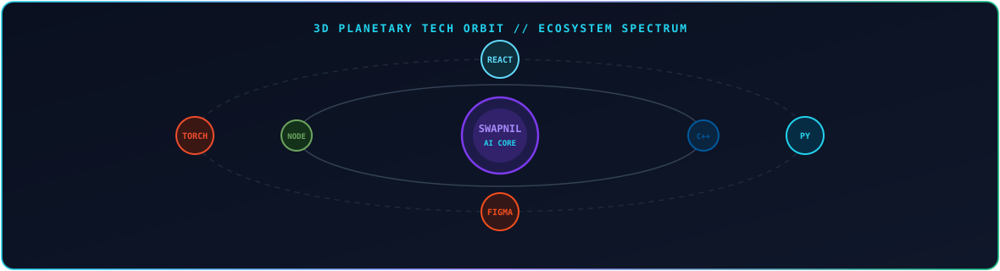

<div align="center">

<!-- Phase 1: Waving Gradient Capsule Header -->


<br/>

<!-- Phase 2: Animated Theme-Aware Live Terminal HUD Banner -->
<picture>
  <source media="(prefers-color-scheme: dark)" srcset="./dark.svg">
  <source media="(prefers-color-scheme: light)" srcset="./light.svg">
  
</picture>

<br/><br/>

<!-- Phase 3: Dynamic Neon Typing Sub-Banner -->
<p align="center">
  <a href="https://github.com/swapnil3104">
    
  </a>
</p>

<br/>

<!-- Social Badges -->
[](https://linkedin.com/in/swapnil-sanjay-patil3104)
&nbsp;&nbsp;
[](https://instagram.com/patilswap3104)
&nbsp;&nbsp;
[](https://x.com/PatilSwap3104)
&nbsp;&nbsp;
[](https://pinterest.com/swapnilp3104)
&nbsp;&nbsp;
[](https://reddit.com/user/u/Individual_Letter952)
&nbsp;&nbsp;
[](https://mastodon.social)
&nbsp;&nbsp;
[](mailto:swapnilp3104@gmail.com)

</div>

<br/>

<!-- Animated SVG Theme-Aware Section Divider -->
<picture>
  <source media="(prefers-color-scheme: dark)" srcset="./divider_dark.svg">
  <source media="(prefers-color-scheme: light)" srcset="./divider_light.svg">
  
</picture>

### ⚡ About Me

```yaml
sys.user: Swapnil Sanjay Patil
sys.role: Computer Science Engineer
sys.specializations:
  - Artificial Intelligence & Machine Learning (AI/ML)
  - Data Analytics & Predictive Modeling
  - Product Design & Interactive Front-End Development
sys.status: "Building + Learning + Shipping 🚀"
sys.philosophy: "Solving real-world problems through clean code, data, & creative UI."
```

<br/>

<!-- Separate Animation 1: Animated Cyber Terminal Simulator -->
<picture>
  <source media="(prefers-color-scheme: dark)" srcset="./terminal_sim_dark.svg">
  <source media="(prefers-color-scheme: light)" srcset="./terminal_sim_light.svg">
  
</picture>

<br/>

<!-- Animated SVG Theme-Aware Section Divider -->
<picture>
  <source media="(prefers-color-scheme: dark)" srcset="./divider_dark.svg">
  <source media="(prefers-color-scheme: light)" srcset="./divider_light.svg">
  
</picture>

### 🛠️ Tech Stack & Visual Ecosystem

<!-- Unified SkillIcons Vector Graphics Grid -->
<div align="center">

<p align="center">
  <a href="https://skillicons.dev">
    
  </a>
</p>

</div>

<br/>

<!-- Separate Animation 2: Animated 3D Tech Orbit Planetary Card -->
<picture>
  <source media="(prefers-color-scheme: dark)" srcset="./tech_orbit_dark.svg">
  <source media="(prefers-color-scheme: light)" srcset="./tech_orbit_light.svg">
  
</picture>

<br/>

#### 🧠 Artificial Intelligence, Machine Learning & Data Science
<p>
  
  
  
  
  
  
  
  
  
  
  
</p>

#### 💻 Software & Web Engineering
<p>
  
  
  
  
  
  
  
  
  
  
  
  
  
</p>

#### 🗄️ Databases & Systems
<p>
  
  
  
</p>

#### 🎨 Product Designer & 3D Modeling
<p>
  
  
  
  
  
</p>

#### 🛠️ Tools & Version Control
<p>
  
  
</p>

<br/>

<!-- Animated SVG Theme-Aware Section Divider -->
<picture>
  <source media="(prefers-color-scheme: dark)" srcset="./divider_dark.svg">
  <source media="(prefers-color-scheme: light)" srcset="./divider_light.svg">
  
</picture>

### 🏆 GitHub Trophies & Achievements

<div align="center">

<!-- Clickable Trophies Banner -->
<a href="https://github.com/swapnil3104?tab=achievements">
  
</a>

<br/><br/>

<!-- Official GitHub Achievement Badges -->
<p align="center">
  <a href="https://github.com/swapnil3104?tab=achievements" title="GitHub Achievements">
    
  </a>
  &nbsp;&nbsp;
  <a href="https://github.com/swapnil3104?tab=achievements" title="GitHub Achievements">
    
  </a>
  &nbsp;&nbsp;
  <a href="https://github.com/swapnil3104?tab=achievements" title="GitHub Achievements">
    
  </a>
  &nbsp;&nbsp;
  <a href="https://github.com/swapnil3104?tab=achievements" title="GitHub Achievements">
    
  </a>
  &nbsp;&nbsp;
  <a href="https://github.com/swapnil3104?tab=achievements" title="GitHub Achievements">
    
  </a>
  &nbsp;&nbsp;
  <a href="https://github.com/swapnil3104?tab=achievements" title="GitHub Achievements">
    
  </a>
</p>

<br/>

<!-- Direct Link Button Badge -->
[](https://github.com/swapnil3104?tab=achievements)

</div>

<br/>

<!-- Animated SVG Theme-Aware Section Divider -->
<picture>
  <source media="(prefers-color-scheme: dark)" srcset="./divider_dark.svg">
  <source media="(prefers-color-scheme: light)" srcset="./divider_light.svg">
  
</picture>

### 📊 GitHub Activity & Performance Metrics

<!-- Streak Card -->


<br/><br/>

<!-- Stats & Top Languages Side-by-Side -->
<table border="0" width="100%">
  <tr>
    <td width="50%" valign="top">
      
    </td>
    <td width="50%" valign="top">
      
    </td>
  </tr>
</table>

<br/>

<!-- Activity & Profile Dashboard -->


<br/>

> *Note: `hide_rank=true` is enabled because star-weighted GitHub rank metric can be inaccurate for actively growing accounts.*

<br/>

<!-- Animated SVG Theme-Aware Section Divider -->
<picture>
  <source media="(prefers-color-scheme: dark)" srcset="./divider_dark.svg">
  <source media="(prefers-color-scheme: light)" srcset="./divider_light.svg">
  
</picture>

### 🐍 Contribution Activity (Snake Animation)

<!-- Theme-Aware Snake Animation -->
<picture>
  <source media="(prefers-color-scheme: dark)" srcset="https://raw.githubusercontent.com/swapnil3104/swapnil3104/output/github-contribution-grid-snake-dark.svg">
  <source media="(prefers-color-scheme: light)" srcset="https://raw.githubusercontent.com/swapnil3104/swapnil3104/output/github-contribution-grid-snake.svg">
  
</picture>

<br/>

<!-- Animated SVG Theme-Aware Section Divider -->
<picture>
  <source media="(prefers-color-scheme: dark)" srcset="./divider_dark.svg">
  <source media="(prefers-color-scheme: light)" srcset="./divider_light.svg">
  
</picture>

<div align="center">

<!-- Profile Visitor Counter -->


<br/>

<sub>⚡ Built with precision according to the GitHub Profile Master Pipeline</sub>

</div>
